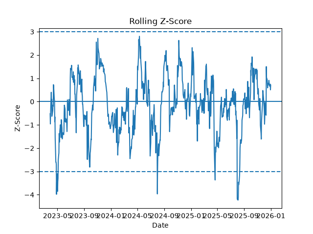
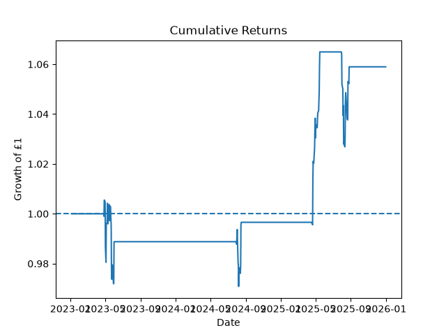
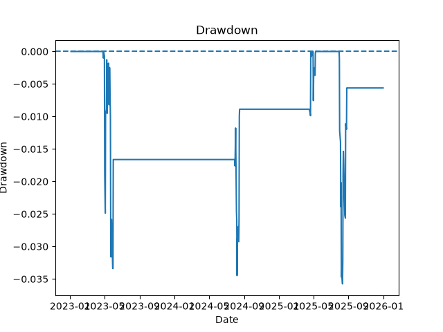
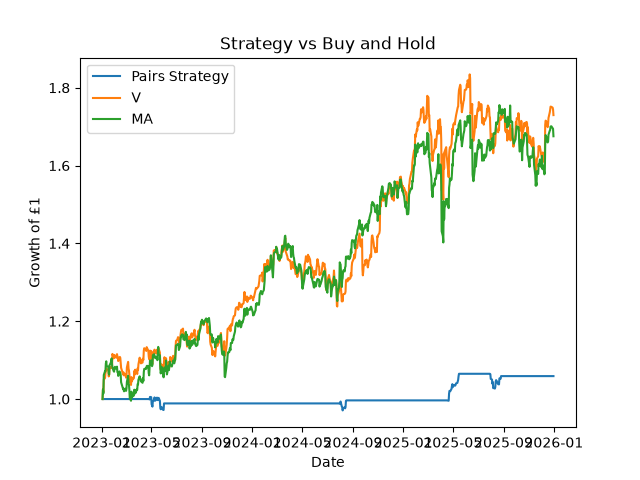

# Statistical Arbitrage Backtester

I built this project to learn more about pairs trading and how statistical methods can be used to test relationships between stocks.

The current version uses Visa (`V`) and Mastercard (`MA`) and tests whether changes in the relationship between their prices can be used to generate trading signals.

## How it works

The program downloads historical stock data from 2018 to 2025 using `yfinance` and then calculates daily percentage returns for both stocks.

I split the data into:

- Training data: 2018 to 2022
- Test data: 2023 to 2025

The training period is used to study the relationship between the two stocks. The test period is kept separate so that the trading strategy can be tested on later data rather than being built using the same period it is evaluated on.

### 1. Correlation

The program first calculates the correlation between the daily returns of Visa and Mastercard.

Correlation measures how closely two variables move together. A value close to `1` means the two stocks often move in the same direction, while a value close to `0` means there is much less of a relationship between their daily movements.

A high correlation can make a pair worth investigating, but correlation by itself does not mean that the price relationship is stable over the long term.

### 2. OLS regression and the spread

I use Ordinary Least Squares (OLS) regression to model Visa as a function of Mastercard:

```text
A = alpha + beta * B
```

Where:

- `A` is Visa
- `B` is Mastercard
- `alpha` is the constant part of the relationship
- `beta` measures how strongly A changes relative to B

The regression gives an expected value for Visa based on Mastercard's price.

The spread is then calculated as:

```text
spread = actual A - predicted A
```

If the spread is positive, Visa is trading above the value suggested by the regression. If the spread is negative, Visa is trading below it.

The strategy is based on the idea that if this spread moves unusually far away from its normal level, it may later move back towards that level.

### 3. Stationarity and cointegration

I use the Augmented Dickey-Fuller (ADF) test on the training spread.

A stationary spread is one that tends to move around a relatively stable level instead of drifting further and further away over time. This is useful for a mean-reversion strategy because the strategy assumes that large changes in the spread may eventually reverse.

I also use an Engle-Granger cointegration test on the two stock prices.

Cointegration checks whether two price series appear to have a stable long-term relationship even if both prices individually trend over time.

For both tests, the p-value is important. A low p-value gives evidence against the null hypothesis, so a low cointegration p-value supports the idea that the two stocks have a long-term relationship.

### 4. Rolling regression

The relationship between two companies can change over time, so I do not use one fixed alpha and beta for the whole test period.

For every date in the test data, the program takes the previous 60 trading days and runs another OLS regression.

This creates a rolling `alpha` and `beta` for each date.

The current date is excluded from this 60-day regression window, so the model only uses information that would already have been available before that day.

The test spread is then calculated using:

```text
spread = A - (alpha + beta * B)
```

Because alpha and beta are updated over time, the spread can adapt to changes in the Visa-Mastercard relationship.

### 5. Rolling z-score

The program calculates a 60-day rolling mean and standard deviation of the spread.

It then calculates the z-score:

```text
z-score = (spread - rolling mean) / rolling standard deviation
```

The z-score tells me how unusual the current spread is compared with its recent history.

For example:

- a z-score near `0` means the spread is close to its recent average
- a z-score of `+2` means the spread is about two standard deviations above its recent average
- a z-score of `-2` means it is about two standard deviations below its recent average

The larger the absolute z-score, the more unusual the current relationship is.



The dashed lines at `+3` and `-3` show the entry level for the most selective threshold tested.

## Trading rules

The strategy tests entry thresholds of `1.5`, `2.0`, `2.5` and `3.0`.

For each threshold:

- if the z-score is above the entry threshold, the strategy shorts the spread
- if the z-score is below the negative entry threshold, the strategy goes long the spread
- if the absolute z-score falls below `0.5`, the position is closed
- otherwise, the previous position is kept

A long spread position means the strategy is expecting the spread to rise back towards normal. A short spread position means the strategy is expecting the spread to fall back towards normal.

The program stores positions as:

```text
1 = long spread
-1 = short spread
0 = no position
```

The trading signal is shifted forward by one day so that a signal calculated using today's prices is applied to the following day's return rather than the same day's return.

The daily pair return is calculated using the hedge ratio from the rolling regression:

```text
pair return = return of A - beta * return of B
```

I also include a transaction cost of `0.1%` whenever the position changes.

## Performance measures

For each threshold, the program calculates:

- **Cumulative return** - the total compounded return over the test period
- **Sharpe ratio** - average return compared with the volatility of those returns
- **Maximum drawdown** - the largest fall from a previous portfolio peak
- **Position changes** - how often the strategy changed its trading position

### Cumulative returns

This graph shows the growth of £1 using the `3.0` entry threshold. Flat sections are periods where the strategy has no open position.



### Drawdown

Drawdown measures how far the strategy is below its previous highest portfolio value. A value of `0` means the strategy is at a new peak, while negative values show a decline from that peak.



## Results

For Visa and Mastercard, the `3.0` threshold performed best during the 2023-2025 test period.

It produced approximately:

- 5.9% cumulative return
- 0.55 Sharpe ratio
- -3.6% maximum drawdown

The lower thresholds traded more frequently and produced negative returns in this test period.

I also compare the strategy with simply buying and holding Visa and Mastercard over the same period.

Buy-and-hold produced much higher returns and higher Sharpe ratios, while the pairs strategy had a much smaller maximum drawdown.

### Strategy vs Buy and Hold

The graph below compares the growth of £1 in the pairs strategy with simply buying and holding Visa or Mastercard over the same test period.



## Libraries used

- Python
- pandas
- NumPy
- Matplotlib
- statsmodels
- yfinance
